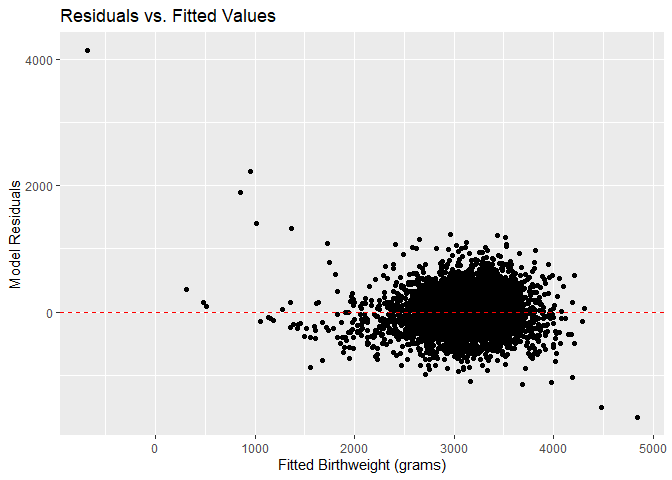
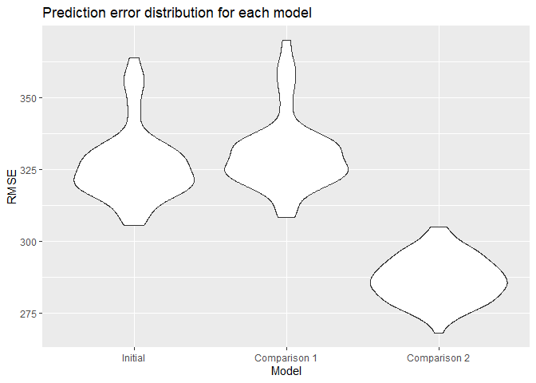
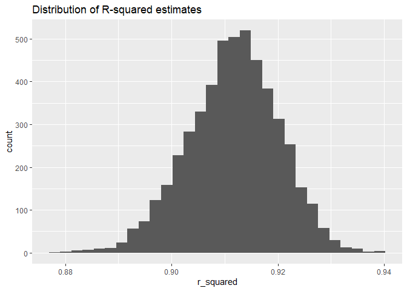
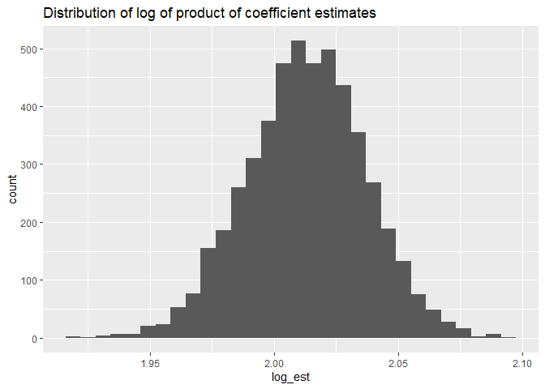

Homework \#6
================
Robert Tumasian (rat2134)
11/19/2019

``` r
#Load required packages
library(tidyverse)
library(modelr)
library(mgcv)
```

# Problem 1

``` r
#Import and clean data
birthweight_data = 
  read.csv("./hw6_data/birthweight.csv") %>%
  mutate(babysex = factor(babysex),
         frace = factor(frace),
         malform = factor(malform),
         mrace = factor(mrace),
         babysex = recode(babysex,
                          "1" = "male", "2" = "female"),
         frace = recode(frace,
                        "1" = "white", "2" = "black", "3" = "asian",
                        "4" = "puerto rican", "8" = "other",
                        "9" = "unknown"),
         malform = recode(malform,
                           "0" = "absent", "1" = "present"),
         mrace = recode(mrace,
                        "1" = "white", "2" = "black", "3" = "asian",
                        "4" = "puerto rican", "8" = "other"))

#Check for missing data
length(which(is.na(birthweight_data))) 
```

    ## [1] 0

All categorical variables were converted to factors and there are no
missing values in the `birthweight` dataset. Now, we will identify an
most appropriate regression model for birthweight. We will hypothesize
that the following variables underly birthweight:

  - `babysex`: the baby’s sex (male or female)
  - `blength`: the baby’s length (in centimeters)
  - `fincome`: family income (in dollars)
  - `gaweeks`: gestational age (in weeks)
  - `malform`: the presence of malformations (absent or present)
  - `momage`: the mother’s age (in years)
  - `smoken`: average number of cigarettes smoked per day during
    pregnancy

The variables above will be used in our initial regression model for
birthweight.

``` r
#Regression model
birthweight_reg_model = lm(bwt ~ babysex + blength + fincome + gaweeks + 
                             malform + momage + smoken, 
                           data = birthweight_data)

summary(birthweight_reg_model)
```

    ## 
    ## Call:
    ## lm(formula = bwt ~ babysex + blength + fincome + gaweeks + malform + 
    ##     momage + smoken, data = birthweight_data)
    ## 
    ## Residuals:
    ##     Min      1Q  Median      3Q     Max 
    ## -1669.8  -214.0   -14.2   203.5  4119.2 
    ## 
    ## Coefficients:
    ##                  Estimate Std. Error t value Pr(>|t|)    
    ## (Intercept)    -4353.3055    99.3797 -43.805  < 2e-16 ***
    ## babysexfemale    -17.4441    10.0823  -1.730   0.0837 .  
    ## blength          126.3491     1.9907  63.468  < 2e-16 ***
    ## fincome            1.4632     0.2042   7.165 9.10e-13 ***
    ## gaweeks           26.0012     1.7131  15.178  < 2e-16 ***
    ## malformpresent    80.5029    85.1990   0.945   0.3448    
    ## momage             5.6066     1.3693   4.094 4.31e-05 ***
    ## smoken            -3.2564     0.6810  -4.782 1.80e-06 ***
    ## ---
    ## Signif. codes:  0 '***' 0.001 '**' 0.01 '*' 0.05 '.' 0.1 ' ' 1
    ## 
    ## Residual standard error: 329.1 on 4334 degrees of freedom
    ## Multiple R-squared:  0.5878, Adjusted R-squared:  0.5871 
    ## F-statistic: 882.9 on 7 and 4334 DF,  p-value: < 2.2e-16

From our regression results above, we can see that `babysex` and
`malform` are not significantly associated with birthweight (`bwt`),
since `p < 0.05`. Therefore, we can remove these variables from the
model.

``` r
#New regression model
new_birthweight_reg_model = lm(bwt ~ blength + fincome + gaweeks + momage + smoken, 
                           data = birthweight_data)

summary(new_birthweight_reg_model)
```

    ## 
    ## Call:
    ## lm(formula = bwt ~ blength + fincome + gaweeks + momage + smoken, 
    ##     data = birthweight_data)
    ## 
    ## Residuals:
    ##     Min      1Q  Median      3Q     Max 
    ## -1666.3  -214.2   -15.3   203.5  4139.5 
    ## 
    ## Coefficients:
    ##               Estimate Std. Error t value Pr(>|t|)    
    ## (Intercept) -4375.7786    98.5022 -44.423  < 2e-16 ***
    ## blength       126.7583     1.9764  64.137  < 2e-16 ***
    ## fincome         1.4630     0.2042   7.163 9.21e-13 ***
    ## gaweeks        25.7925     1.7095  15.087  < 2e-16 ***
    ## momage          5.6994     1.3688   4.164 3.19e-05 ***
    ## smoken         -3.1931     0.6804  -4.693 2.77e-06 ***
    ## ---
    ## Signif. codes:  0 '***' 0.001 '**' 0.01 '*' 0.05 '.' 0.1 ' ' 1
    ## 
    ## Residual standard error: 329.2 on 4336 degrees of freedom
    ## Multiple R-squared:  0.5874, Adjusted R-squared:  0.5869 
    ## F-statistic:  1235 on 5 and 4336 DF,  p-value: < 2.2e-16

After removing `babysex` and `malform`, the adjusted R-squared value
changes negligibly, meaning that these two variables did not explain any
further variance in the outcome that was not already accounted for by
the other variables in the model. Therefore, removing them was
appropriate.

``` r
#Plot of model residuals against fitted values
add_residuals(birthweight_data, new_birthweight_reg_model) %>%
  add_predictions(new_birthweight_reg_model) %>%
  ggplot(aes(x = pred, y = resid)) +
  geom_point() +
  labs(
    title = "Residuals vs. Fitted Values",
    x = "Fitted Birthweight (grams)",
    y = "Model Residuals"
  ) +
  geom_hline(yintercept = 0, linetype = "dashed", color = "red")
```

<!-- -->

Not all of the model residuals seem to be scattered randomly around `y
= 0` (outliers are present). Therefore, one or more of the variables in
the model may have a nonlinear relationship with the outcome of interest
(birthweight). Transforming the birthweight variable or implementing
formal criteria for outlier removal would foster the development of a
stronger model.

``` r
#Model comparison #1
#Using length at birth and gestational age as predictors (main effects only)
comp_model_1 = lm(bwt ~ blength + gaweeks, 
                  data = birthweight_data)
```

``` r
#Model comparison #2
#Using head circumference, length, sex, and all interactions (including three-way)
comp_model_2 = lm(bwt ~ (bhead + blength + babysex)^3, 
                  data = birthweight_data)
```

``` r
set.seed(144)

#Cross-validation
cv_data = 
  crossv_mc(birthweight_data, 100)

cv_data = 
  cv_data %>% 
  mutate(initial_model  = map(train, ~new_birthweight_reg_model),
         model_comp_1 = map(train, ~comp_model_1),
         model_comp_2  = map(train, ~comp_model_2)) %>% 
  mutate(rmse_initial_model = map2_dbl(initial_model, test, ~rmse(model = .x, data = .y)),
         rmse_model_comp_1 = map2_dbl(model_comp_1, test, ~rmse(model = .x, data = .y)),
         rmse_model_comp_2 = map2_dbl(model_comp_2, test, ~rmse(model = .x, data = .y)))

#Plot of the prediction error distribution for each model
cv_data %>% 
  select(starts_with("rmse")) %>% 
pivot_longer(
    everything(),
    names_to = "model", 
    values_to = "rmse",
    names_prefix = "rmse_") %>% 
  mutate(model = fct_inorder(model)) %>% 
  ggplot(aes(x = model, y = rmse)) + 
  geom_violin() +
  scale_x_discrete(labels=c("initial_model" = "Initial", 
                            "model_comp_1" = "Comparison 1",
                            "model_comp_2" = "Comparison 2")) +
  labs(
    title = "Prediction error distribution for each model",
    x = "Model",
    y = "RMSE"
  )
```

<!-- -->

We can see that model comparison \#2 (the model containing head
circumference, length, sex, and all interactions), on average, has the
lowest RMSE and is therefore the strongest model.

# Problem 2

``` r
#Load data
weather_df = 
  rnoaa::meteo_pull_monitors(
    c("USW00094728"),
    var = c("PRCP", "TMIN", "TMAX"), 
    date_min = "2017-01-01",
    date_max = "2017-12-31") %>%
  mutate(
    name = recode(id, USW00094728 = "CentralPark_NY"),
    tmin = tmin / 10,
    tmax = tmax / 10) %>%
  select(name, id, everything())
```

``` r
set.seed(223)

#Bootstrap samples
boot_straps = 
  data_frame(
    strap_number = 1:5000,
    strap_sample = rerun(5000, sample_frac(weather_df, replace = TRUE)))

#Bootstrap results
bootstrap_results = 
  boot_straps %>% 
  mutate(
    models = map(strap_sample, ~lm(tmax ~ tmin, data = .x)),
    results_r2 = map(models, broom::glance),
    results_estimates = map(models, broom::tidy)) %>% 
  select(-strap_sample, -models) %>% 
  unnest() %>%
  select(strap_number, r.squared, term, estimate) %>%
  pivot_wider(
    names_from = "term",
    values_from = "estimate"
  ) %>%
  janitor::clean_names() %>%
  mutate(log_est = log(intercept * tmin))
```

``` r
#Confidence intervals for estimates
quantile(pull(bootstrap_results, r_squared), probs = c(0.025, 0.975))
```

    ##      2.5%     97.5% 
    ## 0.8942086 0.9273336

``` r
quantile(pull(bootstrap_results, log_est), probs = c(0.025, 0.975))
```

    ##     2.5%    97.5% 
    ## 1.965043 2.058939

A 95% confidence interval for the estimated coefficient of determination
is (0.894, 0.927). Similarly, a 95% confidence interval for the log of
the product of the coefficient estimates is (1.965, 2.059).

``` r
ggplot(data = bootstrap_results, aes(x = r_squared)) +
  geom_histogram() +
  labs(title = "Distribution of R-squared estimates")
```

<!-- -->

We can see that the distribution of the estimated coefficients of
determination from our bootstrapping process is fairly normally
distributed. Each of our bootstrap models were able to explain between
88% and 94% of the variance in the outcome (birthweight), which is very
strong.

``` r
ggplot(data = bootstrap_results, aes(x = log_est)) +
  geom_histogram() +
  labs(title = "Distribution of log of product of coefficient estimates")
```

<!-- -->

Similarly, we can see that the distribution of the log of the product of
the coefficient estimates from our bootstrapping process is fairly
normally distributed.
